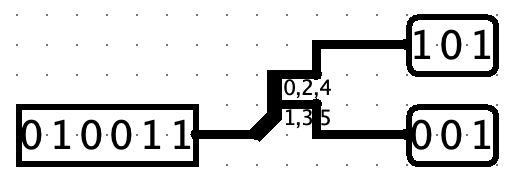
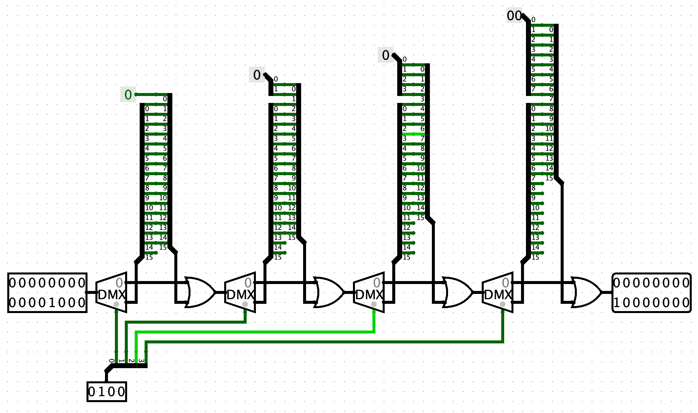

# Pre课下-Logisim

**Logisim 参考手册**
http://www.cburch.com/logisim/docs/2.7/en/html/libs/index.html

## Logisim门电路

### Tunnel
每个Tunnel标签只允许有一个输入，输出的数量不做限制。  
不建议使用太多的Tunnel，防止出现混乱，而且输入Tunnel的标签非常浪费时间。

### Probe
使用Probe进行监控任意导线上传输的内容，无需设置位宽。  
使用Poke Tool进行点击导线同样可以进行查看。

### 全加器的表达式
>    S = A ^ B ^ Cin;  
> Cout = A & B | Cin & (A ^ B);

### 九个不太常见的组件
- Gate
    1. Buffer : 缓冲期。输入什么就输出什么（包括X和E）。可以用于在电路中形成延时，**但是应该只在绝对必要的时候使用延时。”
    2. Odd Parity (2k+1) : 奇校验门，输入中有**奇数个1**时输出为1，否则输入为0。
    3. Even Parity (2k) : 偶校验门，输入中有**偶数个1（含0个）**时输出为1，否则输出为0。
    4. Controlled Buffer : 三态缓冲器。控制端为1时，输出值与输入值相同。控制端为0时，输出值为浮空值x。
    5. Controlled Inverter : 三态反相器。控制端为1时，输出值为输入值取反。控制端为0时，输出值为浮空值x。
- Plexers
    1. Priority Encoder (Pri) : 编码器，Decoder的逆向组件，左侧从上到下从0开始编号。控制端为1或浮空值时，若输入端存在1，则输出最大编号的1所在的编号的二进制数，同时Group Select输出信号1。若控制端为0，或者控制端为1或浮空值但输入端没有1时，则输出端为全浮空值x，同时Group Select输出信号0。控制端为1或浮空值但输入端没有1时，Enable Output输出信号1，否则输出信号0
- Arithmetic
    1. Negator (-x): 取反码器。注取反码的计算规则为各位取反再加1，0b10000000的反码仍然是0b10000000，不会出现溢出的情况
    2. Bit Adder (#) : 按位加法，输出为输入当中有多少个1的二进制数。
- Memory
    1. Shift Register : 移位寄存器。始终上升沿来临时，前一个寄存器存储后一个寄存器的值，最后一个寄存器存储输入的值。提供一个使能端，一个异步清零端。提供一个初始化控制端和初始化数据输入端，当初始化控制端为1且时钟上升沿来临时，各寄存器保存初始化数据输入的值。提供各个寄存器当前保存值的输出端口，最后一个阶段的输出端口额外多提供一个。
    2. Random Generator : 随机数生成器，可以指定种子。提供一个使能端和一个清除端，当清除端为1时，**异步**将输出恢复到种子

### 自己的研究
1. [adder_and_subtractor.circ](./1.Logisim/1.Logisim门电路/adder_and_subtractor.circ) : 加法器和减法器的使用，包括借位和进位的处理
2. [bit_extender.circ](./1.Logisim/1.Logisim门电路/bit_extender.circ) : Bit Extender的在同配置下的拓展的结果演示
3. [splitter.circ](./1.Logisim/1.Logisim门电路/splitter.circ) : Wiring -> Splitter元件的各种样式以及分信号、集信号两个方向的使用
4. [tunnel_and_probe.circ](./1.Logisim/1.Logisim门电路/tunnel_and_probe.circ) : Tunnel和Probe两个工具的使用演示
5. [xor.circ](./1.Logisim/1.Logisim门电路/xor.circ) : 使用与门和或门构建基础异或电路

### 门电路相关题目测试文件
1. [question_1109_816.circ](./1.Logisim/1.Logisim门电路/question_1109_816.circ)
2. [question_1109_818.circ](./1.Logisim/1.Logisim门电路/question_1109_818.circ)

## 题目1109-817 Logisim_基本组件-2

### 题目测试文件
- [quesiton_1109_817.circ](./1.Logisim/1.Logisim门电路/question_1109_817.circ)

这道题目没有特别大的难度，但是有一个坑点。如果直接按照题目的要求直接搭建电路，不修改`Bit Finder`的配置，发现直接就能得到题目中的结果，提交上去却发现错误，而且这道题只有一次提交机会，会成为一个抹不去的未通过，  
这道题的题目的要求在题面上——**下图电路的功能是用来求 Input 的前导 0 个数的**。显然使用`Bit Finder`应该将`Type`属性修改为`Highest-order 1`。但是Logisim中的`Bit Finder`的`Type`属性默认值为`Lowest-order 1`恰好也能得到正确的答案。

## 题目1109-12 搭建swap电路
  
### 源代码文件
- [question_1109_12_1.circ](https://gitee.com/ap0stader/CO_2023_Fall/blob/main/0_Pre/logisim/question_1109_12_1.circ) : 使用普通连线版本
- [question_1109_12_2.circ](https://gitee.com/ap0stader/CO_2023_Fall/blob/main/0_Pre/logisim/question_1109_12_2.circ) : 使用Tunnel版本

### 表达式
> O1 = ~S & I1 | S & I2  
> O2 = S & I1 | ~S & I2

从题目要求中的*请从门级电路开始搭建，切勿使用Plexers类元件*的要求中可以看出这道题目与`Plexers`类元件有着密切的联系。上面的两个表达式是多路选择器(Multiplexer)的表达式，其中S是选择位(Select bits)，O1和O2是这两个`Multiplexer`的输出结果，I1和I2按照不同的次序接入到`Multiplexer`中。  
搭建swap电路，实际上实现了两路的`Multiplexer`。多路选择器还可以继续扩展，从更多的路中选择想要的路作为输出。

### 多路选择器表达式模板
以一个四路的`Multiplexer`为例，其**表达式**如下
> O = (~S1 & ~S0) & I00  
>   | (~S1 &  S0) & I01  
>   | ( S1 & ~S0) & I10  
>   | ( S1 &  S0) & I11

**真值表**如下
| S1  | S0  |  O  |
| :-: | :-: | :-: |
|  0  |  0  | I00 |
|  0  |  1  | I01 |
|  1  |  0  | I10 |
|  1  |  1  | I11 |

为了表达所有可以选择的路，首先需要更多的`Select bits`，一般情况下（包括logisim中），使用**二进制编码**方式按照次序给输入的各路进行编号。  
上面的表达式为用**或**逻辑链接的4个式子，其中每个式子表达的是输入的选择位为某种情况时对应的输出。每个式子的用括号括住的前半部分表达的是何时被选中。后半部分表达的是这种情况下对应的输出。  
前半部分的构造方法为用`&`来连接各个`Select bits`，在被选中的情况的编码中，`Select bits`为0时应加上～。这样构造出来的前半部分当且仅当在被选中的情况下为真，其余情况的构造出来的前半部分均为假，搭配上`|`即可实现多路选择。

需要特别的指出的是，如果输入为**多位**的，应先将括号中的结果的`&`应该**符号**位拓展后再与输入按位与，`|`也应为按位或

> 更多内容可以参见黑书P47-P50 2.8.1节 复用器

## Logisim组合电路

### Splitter
每一个端口输出哪些位可以在属性窗口指定。不一定是**连续**的位，但是输出的时候是按照大小顺序依次输出。  

### 什么时候引入子电路
1. 设计的电路中存在完全重复的部分
2. 完全重复的部分有明确的**独立功能**定义
3. 完全重复的部分有明确的**输入输出**定义
   
### 引入子电路注意事项
1. 要检查外观编辑页面，确定模块的每个输入输出端口在模块内部对应的端口，在外观上应该对于每个端口应该有所标注。
2. 子电路的外观默认是一样的，应在外观上标明子电路的功能。

### Splitter相关题目测试文件  
1. [question_1109_571.circ](./1.Logisim/2.Logisim组合电路/question_1109_571.circ)  
2. [question_1109_572.circ](./1.Logisim/2.Logisim组合电路/question_1109_572.circ)

### Plexers相关题目测试文件
1. [question_1109_573.circ](./1.Logisim/2.Logisim组合电路/question_1109_573.circ) : MUX和Decd  
2. [question_1109_574.circ](./1.Logisim/2.Logisim组合电路/question_1109_574.circ) : MUX和DMX
3. [question_1109_575.circ](./1.Logisim/2.Logisim组合电路/question_1109_575.circ) : 逻辑左移位器

### 自己的研究
1. [smg_decoder.circ](./1.Logisim/2.Logisim组合电路/smg_decoder.circ) : 使用组合逻辑构建的0-9的数码管译码器，输入二进制数，得到对应的数码管的显示的编码
    

## 题目1109-16 排序电路

## Logisim时序电路

### RAM和ROM的使用
1. 使用RAM时，需要将`Data Interface`属性修改为`Separate load and store ports`。二者都需要选择合适的`Data Bit Width`，在实验中一般选择32位（与MIPS的指令长度相匹配），以及选择合适的`Address Bit Width`，在实验中要求确保能够容纳实验要求的指令数量。
2. 使用Poke Tool点击RAM或者ROM的一块数据区域输入即可以修改其中存储的值。
3. RAM和ROM的数据都能通过外部文件导入的方式批量进行修改。右键RAM或ROM，点击`Load Image...`，选择要导入的txt文件即可。文件开头需要添加`v2.0 raw`，内容以**十六进制**书写。`#`开头的行为注释，空格和换行表示分割数据，**分割方式要与数据位宽匹配，否则截取最后的位。**数据量不能超过地址位宽能承载的最大数据量，否则报错，无法导入。可以使用`a*b`方式表示`b`重复`a`次。  
    示例文件[ram_test.txt](./1.Logisim/3.Logisim时序电路/ram_test.txt)：
    > v2.0 raw  
    > 23 23 23 23  
    > 44 04 04 aa  
    > 10*99

    包含上述内容的文件导入后，在`Data Bit Width`和`Address Bit Width`均为8的情况下，RAM中的值为：
    > 23 23 23 23  
    > 44 04 04 aa  
    > 99 99 99 99  
    > 99 99 99 99  
    > 99 99 00 00 ......
4. RAM的各个端口的作用（ROM只有A、右D和sel）
    - A : 选择的地址，位宽要求与`Address Bit Width`属性匹配。
    - 左D : 写入的数据，位宽要求与`Data Bit Width`属性匹配。
    - 右D : 读取的数据，位宽为`Data Bit Width`。
    - 时钟端口
    - sel : 片选端口，输入1或浮空值时表示该RAM工作。输入0时该RAM不工作，不接受数据的写入，右D输出全为浮空值。
    - clr : 异步复位，输入1时，**无论该RAM是否工作**，都将该RAM的所有地址的值置0。
    - str : 是否写入，输入1或浮空值时，时钟上升沿时在选中地址写入左D的输入值。输入0时不接受数据的写入。
    - ld : 是否输出，输入1或浮空值时，右D**异步（无需等待下一个时钟的上升沿**输出选中地址的值。输入0时，右D输出全为浮空值。
5. 保存文件时，RAM中的数据内容不会被保存，ROM中的数据内容会被保存

### Memory相关题目测试文件
1. [question_1109_585.circ](./1.Logisim/3.Logisim时序电路/question_1109_585.circ) : RAM元件的使用
   
### 自己的研究
1. [init_circuit.circ](./1.Logisim/3.Logisim时序电路/init_circuit.circ) : 两种初始化电路的书写方式
    1. 使用 Comparator->Bit Extender->AND Gate->OR Gate
    2. 使用 D Flip-Flop(+Constant)->Multiplexer
2. [latch.circ](./1.Logisim/3.Logisim时序电路/latch.circ) : 从门级搭建锁存器和寄存器，并且演示**异步电路**的竞争条件会导致的问题（黑书P68）
3. [mealy.circ](./1.Logisim/3.Logisim时序电路/mealy.circ) : Mealy型状态机示例以及与Moore型状态机的对比（黑书P78）
4. [moore.circ](./1.Logisim/3.Logisim时序电路/moore.circ) : Moore型状态机实例（黑书P73）

## 题目1109-22 2^n mod 5

## 题目1109-15 斐波那契数列（简单版）

## 题目1109-23 斐波那契数列（CHALLENGE）

