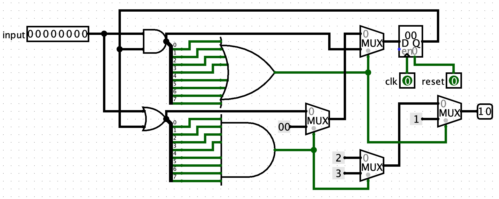

# Pre课上-做题记录

**按照本人做题顺序记录**

## 一、Logisim题
- 题目  
  实现一层俄罗斯方块。input表示在哪一个方块上新放置方块，输出表示当前游戏的状态（01表示放置出现了冲突，10表示放置成功，11表示消除成功并且得分）。要求搭建**Mealy型**状态机。
- 思考  
  1. 本题没有大坑。使用MUX配合常数可以快速简单地完成次态逻辑和输出逻辑的搭建。  
  2. 达到了消除的要求的次态应该是全为0，做好接收之后方块的准备，而不是全1.
- 问题
  1. 提交前没有检查Appearance，导致WA了一次。本次课上测试结束之后，很多同学反应没有注意到Appearance问题，导致了长时间的调试。助教说明无需顾虑子电路的框线与端口的关系，**只要Anchor的Facing和各个端口与Anchor的相对位置是正确的就可以了**
  2. 题目描述略有一些不清楚，没有明确定义reset有效时的操作。在没有明确指定的情况下尝试在reset有效时输出00，结果WA。输出正常放置的时候10，结果AC。
- 参考电路设计  

## 二、ISE题
- 题目  
  输入一个64位的信号，从最高位到最低位每16为一个数字，判断四个数字是否是单调不减的。
- 思考  
  本题是本次课上测试最简单的题目。使用三元运算符嵌套实现即可。

## 三、MARS题
- 题目  
  先输入一个数字，表示数据输入的数量。然后连续输入一组数据，表示海拔的变化。输入完成之后输出最高的海拔。
- 思考  
  上手时觉得要开一个数组保存所有的数据，其实并不必要。使用一个寄存器保存当前海拔的累积计算结果，一个寄存器表示当前的最高的海拔，每一次计算之后与最高的海拔进行比较并且进行更新即可。
- 问题  
  1. 开始编写时忘记了将Memory Configuration设置为Compact, Data at Address 0
  2. 忘记了分隔数据和程序代码要用.data和.text
  3. 忘记了如何使用.space/.word指令
  4. 忘记了.space后的数字单位是bytes，以为是bits
  5. 忘记了if语句和for语句的书写方法（虽然最后尝试出来了）
  6. 误以为MARS有Language Template（找了好久）
