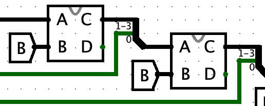
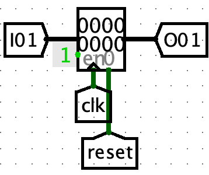
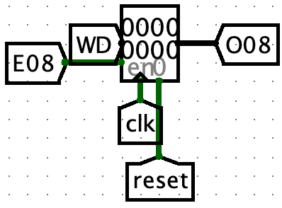
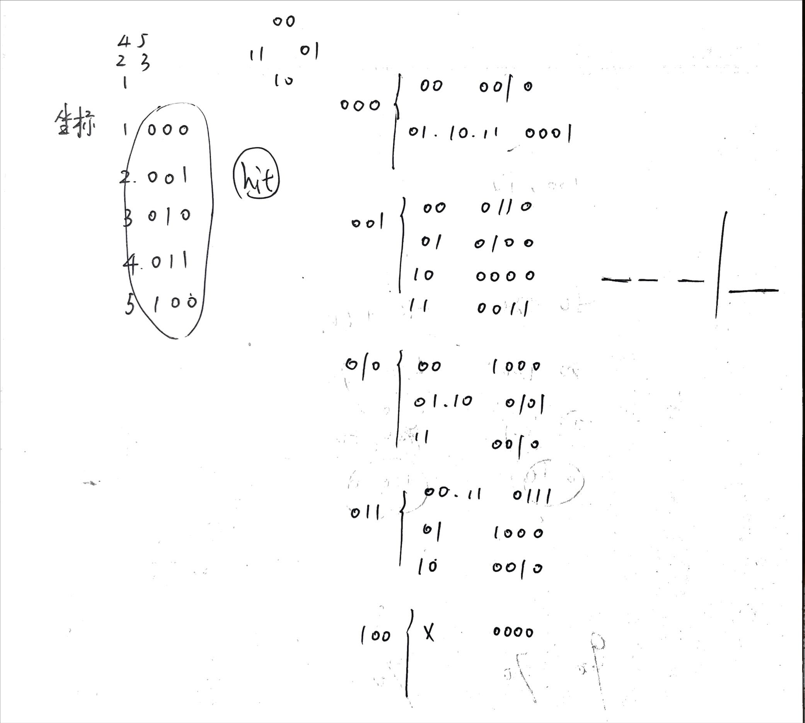
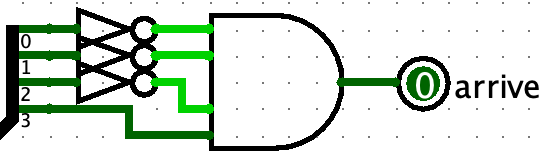
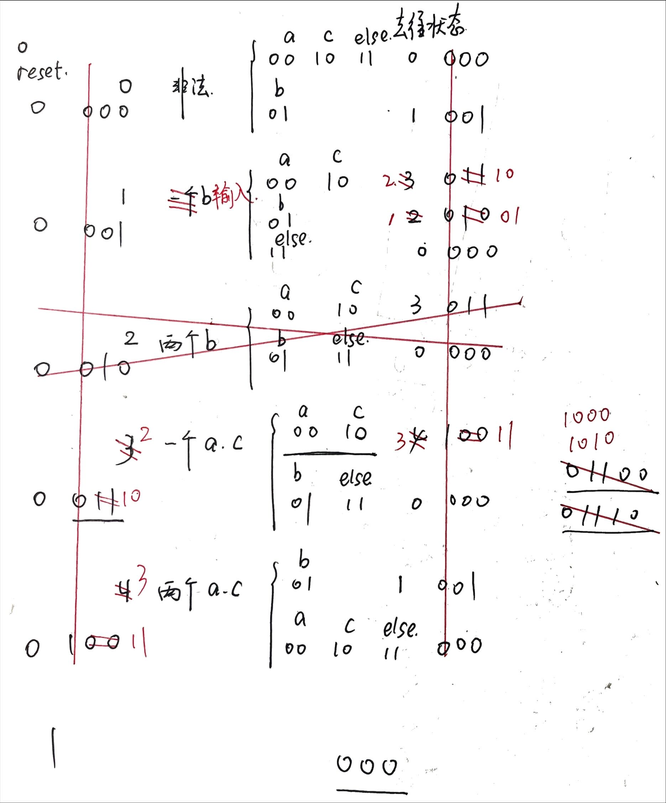
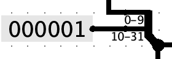
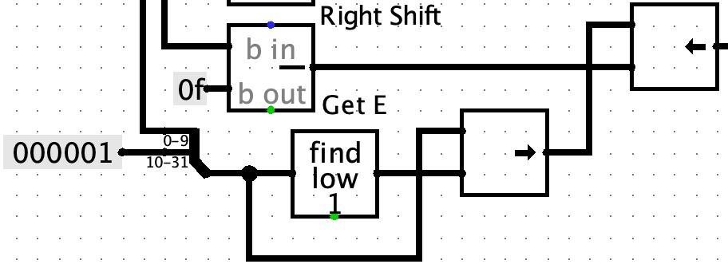
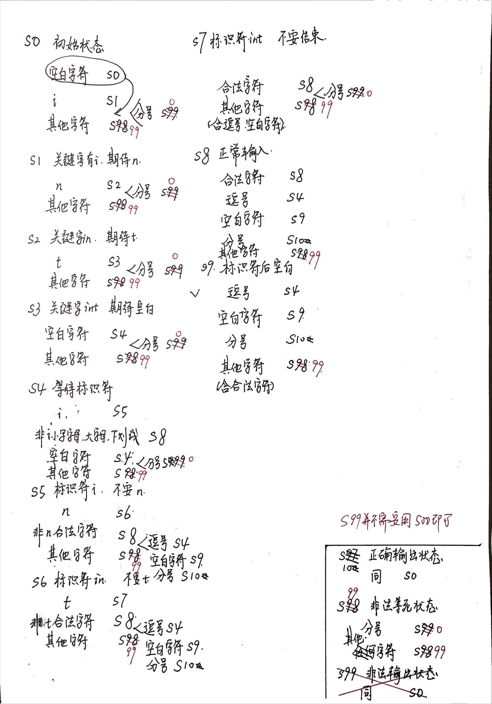

# P0课下-做题记录

## P0.Q1 P0_L0_CRC 题目编号 1119-13

### 源代码文件
- [P0_Q1.circ](https://gitee.com/ap0stader/CO_2023_Fall/blob/main/1_P0/Logisim/P0_Q1.circ) : AC版本

### 思考
根据题目要求，先搭建四位模二除法器，然后将上一个四位模二除法器的余数输出拼接一位被除数作为下一个四位模二除法器的被除数输入，直到被除数所有的位都被使用。
<center></center>

### 问题
1. 题目没有读好：题目中至少两处提示，但是还是直接去处理8位的输入，没有补充3位0。（感谢舍友的提醒，参见<http://cscore.buaa.edu.cn/#/discussion_area/955/1403/posts>）([P0_Q1_wrong.circ](https://gitee.com/ap0stader/CO_2023_Fall/blob/main/1_P0/Logisim/P0_Q1_wrong.circ) : WA版本)。
    - 需要将原帧补上（除数位数 - 1）个 0 作为被除数
    - 直接画出真值表，输入总共 11 位 2 进制码
2. Splitter用反了：拿出来的Splitter默认从上到下是从LSB到MSB。

## P0.Q2 P0_L0_GRF 题目编号 1119-269

### 源代码文件
- [P0_Q2_1.circ](https://gitee.com/ap0stader/CO_2023_Fall/blob/main/1_P0/Logisim/P0_Q2_1.circ) : DMX版本
- [P0_Q2_1.c](https://gitee.com/ap0stader/CO_2023_Fall/blob/main/1_P0/C/P0_Q2_1.c) : DMX版本自动化方法代码
- [P0_Q2_2.circ](https://gitee.com/ap0stader/CO_2023_Fall/blob/main/1_P0/Logisim/P0_Q2_2.circ) : Deco版本
- [P0_Q2_2.c](https://gitee.com/ap0stader/CO_2023_Fall/blob/main/1_P0/C/P0_Q2_2.c) : Deco版本自动化方法代码

### 思考
1. 题目要求的操作对于单个寄存器比较容易实现。但是应用到32个寄存器必然导致大规模的接线/接Tunnel，尤其是接Tunnel时大量进行标签修改非常浪费时间。
    - 考虑子电路。子电路并不能解决这个问题，因为主电路中地址选择涉及一个MUX，子电路连接到MUX上依然存在大规模的接线/接Tunnel。子电路中的输入输出端口接入到对应组件上也是一个浩大的工程。
    - 考虑使用自动化方法。批量接线、接Tunnel、生成其他组件。
2. 对于写入指定的寄存器。重点是要满足有一个输入可以对是否写入进行控制。
    - 每个Register的Enable端口接常数1（或不接Constant保持浮空），输入端口接上一个专属的Tunnel，Tunnel到一个DMX上。输入的数据也接到DMX上，**并且将DMX的Three-state属性设置为Yes，Disabled Output属性设置为Floating。**这样，DMX不使能时，全部的输出都为浮空值；DMX使能时，选中的输出为输入值，其他的输出仍然是浮空值。**Logisim的Register在输入值是浮空值时不更新**，若Three-state属性为No，则其他的输出为全0，会被其他Register更新（参见<http://cscore.buaa.edu.cn/#/discussion_area/961/1375/posts>）。
    <center></center>
    
    - 每个Register的输入端口都接上输入的数据，Enable端口接上一个专属的Tunnel，Tunnel到一个Deco上。***并且将Deco的Three-state属性设置为No，Disabled Output属性设置为Zero。**这样，Deco不使能时，全部的输出都为0，所有的Register不使能。**Logisim的Register在Enable端口为浮空值时依然可以存储数据**，若Disable Output属性为Floating，Deco的输出全为浮空值，会使所有的Register使能。Deco使能时，Deco产生的独热编码让特定的Register使能。
    <center></center>

### 自动化方法
1. Logisim存储的.circ文件本质上是明码XML文件，使用各种文本编辑器均可打开。各个标签对应了电路中的各个部分。其中`<circuit>`标签对应的是子电路。`<wire>`标签对应的是连线，`<comp>`标签对应的是Logisim提供的组件。
2. 为了更加快速地找到**复制单元**的所有标签，可以新建一个子电路，并在该子电路中搭建好复制单元（完成自动化方法后子电路可以删除）。通过`<circuit>`标签的name属性，可以定位到新建的子电路。`<circuit>`和`</circuit>`之间的所有内容就是复制单元各个元件的标签。
3. 定位要更改的信息点：
    1. 各个组件的位置坐标：**把核心组件（如此题中的Register）坐标作为原点，其他组件与原点计算坐标差值**。`<wire>`标签的位置坐标在`from`和`to`两个属性中，`<comp>`标签的位置坐标在`loc`属性中，均为整数偶对。
    2. 两个复制单元的位置差：不能让复制后的各个复制单元处在同一位置。在子电路的x和y方向上各复制一个复制单元，调整到美观的位置后，计算**核心组件的坐标差**（其他的组件在1中已经采用了与原点的坐标差值），即可获得两个复制单元的位置差。
    3. 其他要更改的信息：例如Tunnel中的label属性在`<comp>`标签中的`name`属性为`label`的`<a>`标签处的`val`属性处。其他的属性也类似找到对应的`<a>`标签修改。
4. 接线每拐一个弯，就会多一个`<wire>`标签。如果接线拐的弯太多，识别修改更多的`<wire>`标签会浪费时间。首先应尽量将所有的接线变成直线，其次减少接线（如Tunnel/Constant可以直接贴到Register的接口上使用）。
5. 使用C语言等编程实现XML代码的批量生成。比较省事的办法就是使用C语言的`printf()`函数，将3中定位到的要更改的信息点用格式控制字符进行替换。程序运行结束之后，将控制台输出的结果替换.circ文件中在2中新建的子电路的`<circuit>`标签中的内容。**`<comp>`标签和`<wire>`标签的先后顺序不影响，注意复制时不要复制上控制台的其他输出内容。**
    ```C
    // x, y为核心组件的坐标，可用for循环根据两个复制单元的位置差生成
    printf("    <comp lib=\"4\" loc=\"(%d,%d)\" name=\"Register\">\n"
           "      <a name=\"width\" val=\"32\"/>\n"
           "    </comp>\n",
           x + 00, y + 00);

    printf("    <wire from=\"(%d,%d)\" to=\"(%d,%d)\"/>\n",
           x - 10, y + 20, x - 10, y + 60);
    ```   
6. Logisim不会自动加载在Logisim外的修改，需要重新打开一次文件。正常情况下在子电路中已经生成了对应的组件，复制到主电路中即可使用。

### 问题
1. 提交前没有检查Appearance，导致WA了一次。
2. 知道了DMX设置Three-state的方法之后在提交前没有修改其为Yes，导致WA了一次。

## P0.Q3 P0_L1_navigation_2020 题目编号 1119-393

### 源代码文件
- [P0_Q3.circ](https://gitee.com/ap0stader/CO_2023_Fall/blob/main/1_P0/Logisim/P0_Q3.circ) : AC版本

### 思考
题目要求搭建Moore型有限状态机。写出真值表，使用Logisim的Combinational Analysis工具生成次态逻辑和输出逻辑子电路，按照Moore型有限状态机的结构组装即可。  
本题中所处的位置和是否撞墙描述的是两个方面的事情。在状态编码中，可以**将编码分段**，不同段表示不同方面的事情。如本题状态编码用四位，前三位表示位置，最后一位表示当前是否撞墙。这样不仅更加易于理解，同时可以简化输出逻辑（按照前述编码方式，hit就是状态的最后一位，使用一个Splitter或者Sel即可）。  
使用Logismim的Combinational Analysis工具习惯把其他未定义的状态的次态都定为初始状态。虽然在Logisim的模拟条件下电路不会突然出现异常值，但是实际条件下什么都有可能发生。  
Moore型有限状态机和Mealy型有限状态机相关问题参见<http://cscore.buaa.edu.cn/#/discussion_area/960/1185/posts>。

### 状态设计原稿
<center></center>

### 问题
1. 提交前没有检查Appearance，导致WA了一次。
2. 输出逻辑的非门使用用反了：应该放在上面三个位却放在了最下面的一个位，导致WA了一次。
<center></center>

## P0.Q4 P0_L0_FSM 题目编号 1119-9

### 源代码文件
- [P0_Q4_1.circ](https://gitee.com/ap0stader/CO_2023_Fall/blob/main/1_P0/Logisim/P0_Q4_1.circ) : AC，有问题版本
- [P0_Q4_2.circ](https://gitee.com/ap0stader/CO_2023_Fall/blob/main/1_P0/Logisim/P0_Q4_2.circ) : AC，修正后版本

### 思考
题目要求搭建Mealy型有限状态机。写出真值表，使用Logisim的Combinational Analysis工具生成次态逻辑和输出逻辑子电路，按照Mealy型有限状态机的结构组装即可。  
此题要求的同步复位，我的实现方法是**将CLR作为输入的一位加入到次态逻辑的真值表中**。其他实现方法和相关讨论参见<http://cscore.buaa.edu.cn/#/discussion_area/958/1239/posts>、<http://cscore.buaa.edu.cn/#/discussion_area/963/1188/posts>、<http://cscore.buaa.edu.cn/#/discussion_area/968/1236/posts>、<http://cscore.buaa.edu.cn/#/discussion_area/976/1141/posts>。助教推荐**在Register的输入处使用MUX**进行同步复位。  
Moore型有限状态机和Mealy型有限状态机相关问题参见<http://cscore.buaa.edu.cn/#/discussion_area/960/1185/posts>。

### 状态设计原稿
黑色为有问题的版本，红色笔迹为在原版上的修改
<center></center>

### 问题
1. Splitter用反了：拿出来的Splitter默认从上到下是从LSB到MSB。
2. 第一次AC提交的时候没有考虑到输入多个b也是合法的（如bb<u>bbac</u>），输入了两个b之后若再次输入b就直接恢复到初始的状态了。应该在输入b这个状态形成循环（感谢<http://cscore.buaa.edu.cn/#/discussion_area/954/1317/posts>，另外感谢助教的弱测试数据让我用错误的方式通过了此题）。

## P0.附加题 P0_L1_ftoi 题目编号 1119-319

### 源代码文件
- [P0_ftoi.circ](https://gitee.com/ap0stader/CO_2023_Fall/blob/main/1_P0/Logisim/P0_ftoi.circ) : AC版本

### 思考
这是一个组合逻辑问题。Denormalized整数部分必为0，Infinity和NaN也要求输出0，所以只用计算Normalized型的整数部分。判断后三种只用对exponent进行判断即可，配合MUX可以实现直接输出0。  
针对Normalized型。因为exponent要减去0b01111。即便fraction部分前面有`1.`。但是只要exponent部分小于0x0f，整数部分一定就是0。  
最后判断exponent大于等于0x0f的情况。因为fraction部分有10位，又分为两种情况。
- `exponent - 0x0f` >= 10：等于10时，小数点已经移动到fraction的尾部，若比10大，则要将1与fraction拼贴后左移`exponent - 0x0f - 0x0a`位。
- `exponent - 0x0f` < 10：小数点在fraction的中间，相当于将将1与fraction拼贴后**逻辑右移**`0x0a - (exponent - 0x0f)`位。
注意移动的时候应该先进行位拓展，按照32位int来移动，这样才能正确地舍弃溢出位。  
<center></center>
正负数可以用Negator加上MUX处理。符号位是1，MUX输出Negator对移位后数字取反码的结果。

### 问题
1. **Logisim的Shifter认为移动位数的输入是无符号的**，即不能通过给逻辑左移一个“负数”让其实现逻辑右移。
2. 第一次提交时没有理解公式：先将1与fraction部分进行拼贴，找到最后一位的1，右移掉这个1后的所有的0。并没有理解此时拼贴上去的1其实是1.，这样操作的等价于直接将小数点移动了最后一个1的后面，exponent部分就不能发挥正确的作用了。([P0_ftoi_wrong.circ](https://gitee.com/ap0stader/CO_2023_Fall/blob/main/1_P0/Logisim/P0_ftoi_wrong.circ) : WA版本)
<center></center>

## P0.推荐题目 P1_L2_intcheck 题目编号 1109-336

### 源代码文件
- [intcheck_ok.v](https://gitee.com/ap0stader/CO_2023_Fall/blob/main/1_P0/ISE/question_1109_336/intcheck_ok.v) : AC，未优化版本
- [intcheck.v](https://gitee.com/ap0stader/CO_2023_Fall/blob/main/1_P0/ISE/question_1109_336/intcheck.v) : AC，已优化版本
- [intcheck_test.v](https://gitee.com/ap0stader/CO_2023_Fall/blob/main/1_P0/ISE/question_1109_336/intcheck_test.v) : TestBench

### 思考
这是一个Moore型状态机，写出状态转移设计，按照Verilog编写状态机的标准模式编程进行即可。  
此类序列输入判断型的状态机的设计可以模拟输入场景，一步一步考虑当前情况下所有可能的输入，并且将其依照对于之后判断的影响进行归类，不同的类对应不同的状态。  
对于错误状态和错误结果的输出分离的情况，设置一个专门的状态（“等死”状态），只有输出结果时才能跳出这一个状态（我有对于状态编码连续的强迫症，而这个状态如果夹在正常状态的中间会显得混乱，所以我直接给了一个很大的数字S98，后来的S99，缓解了强迫症）。  
设计时有两点需要注意的：
1. 在各种状态下都要留意输入结束标志，第一版设计中几乎没有考虑到分号（参见设计原稿中大量的插入符号）。
2. 输出状态也是第二次输入开始的状态，次态判断逻辑应与初始状态相同，而不是无条件下一个周期回到初始状态（这样会错过下一次输入的第一个字符）。
模拟输入场景的设计方法可能产生重复状态，设计结束后应当对重复的状态进行合并优化。  
编写时对于字符的判断在if语句中直接使用8位十进制ASCII码数字会更好（制表符对应9，空格对应32），很多编辑器会将制表符修改为多个空格，直接输入可能无法识别（参见<http://cscore.buaa.edu.cn/#/discussion_area/971/1207/posts>）。

### 状态设计原稿
<center></center>

### 问题
1. 使用Testbench进行测试时发现out多次测试都一直为X：编写组件时并没有写initial，同时在Testbench中没有给reset信号。
2. 复制ASCII码的边界值复制错了，小写字母的最大值是122，复制成了102，导致WA了一次([intcheck_wrong.v](https://gitee.com/ap0stader/CO_2023_Fall/blob/main/1_P0/ISE/question_1109_336/intcheck_wrong.v) : WA版本)。
