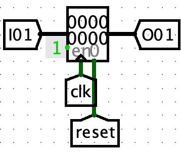
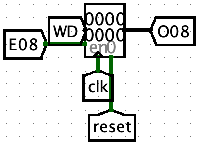
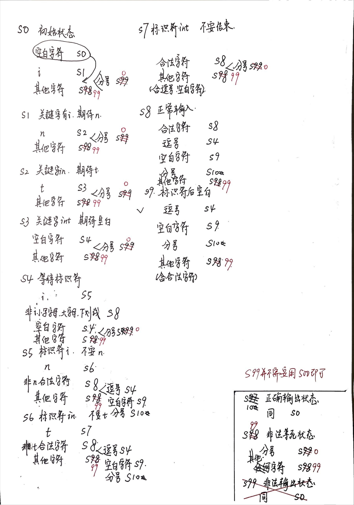

# P0课下-做题记录

## P0.Q1 P0_L0_CRC 题目编号 1119-13

### 源代码文件
- [P0_Q1.circ](https://gitee.com/ap0stader/CO_2023_Fall/blob/main/1_P0/Logisim/P0_Q1.circ) : AC版本

### 思考
根据题目的要求，先搭建四位模二除法器，然后将上一个四位模二除法器的余数输出，拼接一位被除数作为下一个四位模二除法器的被除数输入，直到被除数所有的位都被使用。
<center></center>

### 问题
1. 题目没有读好：题目中至少两处提示，但是还是直接按照输入8位来进行处理的，没有按照要求补充3位0。([P0_Q1_wrong.circ](https://gitee.com/ap0stader/CO_2023_Fall/blob/main/1_P0/Logisim/P0_Q1_wrong.circ) : WA版本)
    - 需要将原帧补上（除数位数 - 1）个 0 作为被除数
    - 直接画出真值表，输入总共 11 位 2 进制码
2. Splitter用反了，拿出来的Splitter默认从上到下是从LSB到MSB

## P0.Q2 P0_L0_GRF 题目编号 1119-269

### 源代码文件
- [P0_Q2_1.circ](https://gitee.com/ap0stader/CO_2023_Fall/blob/main/1_P0/Logisim/P0_Q2_1.circ) : DMX版本
- [P0_Q2_1.c](https://gitee.com/ap0stader/CO_2023_Fall/blob/main/1_P0/C/P0_Q2_1.c) : DMX版本自动化方法代码
- [P0_Q2_2.circ](https://gitee.com/ap0stader/CO_2023_Fall/blob/main/1_P0/Logisim/P0_Q2_2.circ) : Deco版本
- [P0_Q2_2.c](https://gitee.com/ap0stader/CO_2023_Fall/blob/main/1_P0/C/P0_Q2_2.c) : Deco版本自动化方法代码

### 思考
1. 这些操作的实现对于单个寄存器比较简单。但是应用到32个寄存器必然导致了大规模的接线/接Tunnel的问题，尤其是接Tunnel时大量进行标签的修改非常浪费时间。
    - 考虑子电路。子电路并不能解决这个问题，因为主电路中地址选择涉及一个MUX，子电路连接到MUX上依然存在大规模的接线/接Tunnel的问题。子电路中的输入输出端口接入到对应组件上也是一个浩大的工程。
    - 考虑使用自动化方法。批量生成Tunnel、接线、生成其他组件。
2. 对于指定地址写入。重点是要满足有一个输入可以对是否写入进行控制。
    - 每个Register的Enable端口一直为1。每个Register的输入接上一个专属的Tunnel，Tunnel到一个DMX上。输入的数据也接入DMX上，**并且将DMX的Three-state属性设置为Yes，Disabled Output属性设置为Floating。**这样，不使能时，全部的输出都为浮空值；使能时，选中的输出为输入值，其他的输入仍然是浮空值（若Three-state属性为No，则其他的输出为全0，会被其他Register更新），**Logisim的Register在输入值是浮空值时不更新**。
    <center></center>

    - 每个Register的输入都接上输入的数据。每个Register的Enable端口接上一个专属的Tunnel，Tunnel到一个Deco上。***并且将DMX的Three-state属性设置为No，Disabled Output属性设置为Zero。**这样，不使能时，全部的输出都为0，所有的Register不使能（若Disable Output属性为Floating，Deco的输出全为浮空值，**Logisim的Register的Enable端口为浮空值时依然可以存储数据**）。使能时，Deco产生的独热编码让特定的Register使能。
    <center></center>

### 自动化方法
1. Logisim存储的.circ文件本质上是明码XML文件，使用VS Code打开即可。各个标签对应了电路中的各个部分。其中<wire>标签对应的是连线，<comp>标签对应的是系统组件。
2. 为了更加快速找到一个要被复制的单元的所有信息，最好新建一个子电路，在新的子电路中搭建好复制单元结构（完成自动化方法步骤后子电路可以删除）。通过<circuit>标签的name属性，可以定位到新建立的子电路。<circuit>和</circuit>之间的所有内容就是复制单元各个元件的标签。
3. 定位要更改的信息点：
    1. 各个组件的位置坐标：**以核心组件作为原点（如此题中的Register，其他组件的坐标通过计算与原点的坐标差值得到**。<wire>类型的位置坐标在from和to两个属性中，<comp>类型的位置坐标在loc属性中，均为整数偶对。
    2. 两个复制单元的位置差：不能将各个复制单元复制到同一位置。在子电路中的x和y方向上各复制一个复制单元，调整到美观的位置后，计算**核心组件的坐标差**（其他的组件在1中已经采用了与原点的坐标差值，也会自动更改过去）。即可获得两个复制单元的位置差。
    3. 其他要更改的信息：例如Tunnel中的label在<comp>标签中的name属性为`label`的`<a>`标签处的`val`属性处。其他的组件也类似找到对应的`<a>`标签修改。
4. 对于<wire>标签，接线每拐一个弯，就会多一个<wire>标签。如果接线拐的弯太多，<wire>标签也会非常多。首先应尽量将所有的接线变成直线，其次减少接线（如Tunnel/Constant可以直接贴到Register的接口上使用）。
5. 使用C语言等变成语言实现XML代码的批量生成。比较省事的办法就是使用printf函数，将3中定位要更改的信息点用格式控制字符进行替换。**<comp>标签和<wire>标签的先后顺序不影响**程序运行结束之后，将控制台输出的结果替换.circ文件中在2中新建的子电路的<circuit>标签中的内容。**复制时不要复制上控制台的其他内容。**
```C
// x, y为核心组件的坐标，可用for循环根绝两个复制单元的位置差生成
printf("    <comp lib=\"4\" loc=\"(%d,%d)\" name=\"Register\">\n"
       "      <a name=\"width\" val=\"32\"/>\n"
       "    </comp>\n",
       x + 00, y + 00);

printf("    <wire from=\"(%d,%d)\" to=\"(%d,%d)\"/>\n",
       x - 10, y + 20, x - 10, y + 60);
```   
6. Logisim不会自动加载在外部修改器的修改，需要重新打开一次文件。正常情况下在子电路中已经生成了对应的组件，复制到主电路中即可使用。

### 问题
1. 提交前没有检查Appearance，导致WA了一次。
2. 知道了DMX设置Three-state的方法之后在提交前没有修改其为Yes，导致WA了一次。

## P0.Q3 P0_L1_navigation_2020 题目编号 1119-393

### 源代码文件
- [P0_Q3.circ](https://gitee.com/ap0stader/CO_2023_Fall/blob/main/1_P0/Logisim/P0_Q3.circ) : AC版本

### 思考
题目要求搭建Moore型有限状态机。写出真值表，使用Logisim的组合电路生成工具生成次态逻辑和输出逻辑子电路，按照Moore型有限状态机的结构组装即可。  
本题中所处的位置和是否撞到墙描述的是两个方面的事情，在状态编码中，可以**将编码分段**，不同段的表示不同方面的事情。如本题状态编码用四位，前三位表示位置，最后一位表示当前是否撞墙。这样不仅更加易于理解，同时可以简化输出逻辑（按照前述编码方式，输出hit就是状态的最后一位，使用一个Splitter或者Sel即可）  
使用Logismim的组合电路生成工具习惯把其他未定义的状态的次态都定位为初始状态。虽然在Logisim的模拟条件下不会出现电路突然出现的异常值

### 状态转移图设计原稿
<center></center>

### 问题
1. 提交前没有检查Appearance，导致WA了一次。
2. 输出逻辑的非门使用用反了。应该放在上面三个位却放在了最下面的一个位，导致WA了一次。
<center></center>

## P0.Q4 P0_L0_FSM 题目编号 1119-9

### 源代码文件
- [P0_Q4_1.circ](https://gitee.com/ap0stader/CO_2023_Fall/blob/main/1_P0/Logisim/P0_Q4_1.circ) : AC，有问题版本
- [P0_Q4_2.circ](https://gitee.com/ap0stader/CO_2023_Fall/blob/main/1_P0/Logisim/P0_Q4_2.circ) : AC，修正后版本

### 思考
题目要求搭建Mealy型有限状态机。写出真值表，使用Logisim的组合电路生成工具生成次态逻辑和输出逻辑子电路，按照Mealy型有限状态机的结构组装即可。  
同步复位在此题中可以将CLR**作为输入的一位加入到次态逻辑的判断中**。

### 状态转移图设计原稿
黑色为有问题的版本，红色笔迹为在原版上的修改
<center></center>

### 问题
1. Splitter用反了，拿出来的Splitter默认从上到下是从LSB到MSB
2. 第一次AC提交的时候，其实没有考虑到输入多个b其实也是合法的（bb<u>bbac</u>），输入了两个b之后若再次输入b就直接恢复到初始的状态了，在输入b这个状态形成循环。（感谢<http://cscore.buaa.edu.cn/#/discussion_area/954/1317/posts>，另外感谢助教的弱测试数据让我用错误的方式通过了此题（bushi）

## P0.附加题 P0_L1_ftoi 题目编号 1119-319

### 源代码文件
- [P0_ftoi.circ](https://gitee.com/ap0stader/CO_2023_Fall/blob/main/1_P0/Logisim/P0_ftoi.circ) : AC版本

### 思考

### 问题
([P0_ftoi.circ](https://gitee.com/ap0stader/CO_2023_Fall/blob/main/1_P0/Logisim/P0_ftoi.circ) : WA版本)

## P0.推荐题目 P1_L2_intcheck 题目编号 1109-336

### 源代码文件
- [intcheck_ok.v](https://gitee.com/ap0stader/CO_2023_Fall/blob/main/1_P0/ISE/question_1109_336/intcheck_ok.v) : AC，未优化版本
- [intcheck.v](https://gitee.com/ap0stader/CO_2023_Fall/blob/main/1_P0/ISE/question_1109_336/intcheck.v) : AC，已优化版本
- [intcheck_test.v](https://gitee.com/ap0stader/CO_2023_Fall/blob/main/1_P0/ISE/question_1109_336/intcheck_test.v) : TestBench

### 思考

### 状态转移图设计原稿
<center></center>

### 问题
1. testbench记得给reset信号
2. 复制ASCII码的边界值复制错了，小写字母的最大值是122，复制成了102([intcheck_wrong.v](https://gitee.com/ap0stader/CO_2023_Fall/blob/main/1_P0/ISE/question_1109_336/intcheck_wrong.v) : WA版本)。