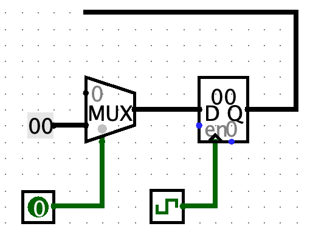

# P0课上-助教提问

1. 展示第2题的电路，说明第2题的设计思路
    - 我的回答：
        - 根据题目要求书写状态转移表。
        - 使用Logisim生成次态逻辑和输出逻辑。
        - 按照Mealy型状态机的基本模式进行组装。

2. (电路设计)如何实现同步复位
    - 我的回答：
        - 方法一：将复位信号作为输入的一位加入到次态逻辑的真值表中。
        - 方法二：MUX的0输入接入次态逻辑的输出，寄存器的输出接入次态逻辑的输入，在合适的位置接上输出逻辑。  
            

3. (Logisim)`Tick Once`和`Step Simulation`的区别
    - 我的回答：
        - `Tick Once`是让是时钟变化一次。
        - `Step Simulation`是让Logisim以最小的模拟颗粒度仿真一次，一般不足以导致时钟变化一次。

4. (Logisim)如何在RAM中导入数据
    - 我的回答同Pre课上
