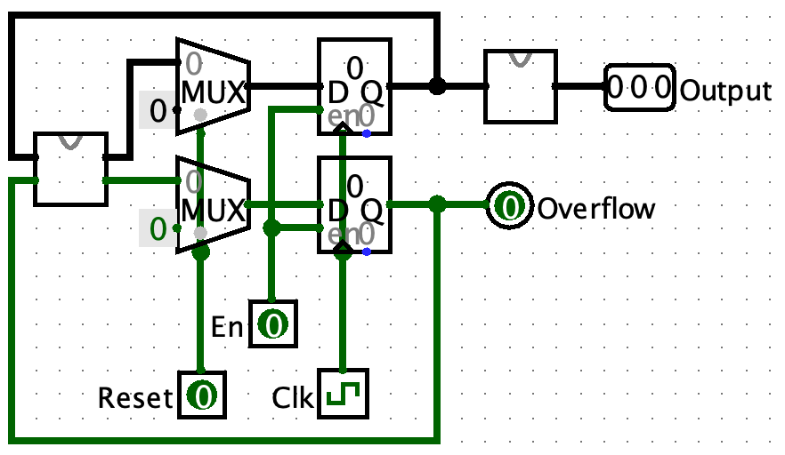

# P1课下-做题记录

## P1.Q1 P1_L0_splitter 题目编号 1120-30

### 源代码文件
- [splitter.v](https://gitee.com/ap0stader/CO_2023_Fall/blob/main/2_P1/ISE/P1_Q1/splitter.v)

一道基础复习题。复习创建工程，新建模块，定义单位和多位的输出，assign语句的使用。


## P1.Q2 P1_L0_ALU 题目编号 1120-27

### 源代码文件
- [alu.v](https://gitee.com/ap0stader/CO_2023_Fall/blob/main/2_P1/ISE/P1_Q2/alu.v)
- [alu_test.v](https://gitee.com/ap0stader/CO_2023_Fall/blob/main/2_P1/ISE/P1_Q2/alu_test.v) : TestBench

### 思考
一道基础练习题。核心是实现一个MUX。既可以用三元运算符嵌套完成，也可以用`always`配合`case`来完成。个人认为使用后一种更好。  
使用三元运算符嵌套完成，要注意将符号右移的部分单独提取出来，或对其整体加上`$signed()`以避免无符号性向内传播（参见<http://cscore.buaa.edu.cn/#/discussion_area/987/1182/posts>）。  
使用`always`配合`case`来完成，组合逻辑的`always`中要注意使用**阻塞赋值**，并且将被赋值的要是**reg类型**。`case`要注意`default`分支，避免不正确生成寄存器。若确实要有保存上一次的功能的，应该显式声明一个寄存器。

### 问题
1. **ISE中数字没有声明位宽，默认为32为位，没有声明数字类型，默认为十进制。**，第一次提交时，case语句中表示各情况的数字没有写位宽和进制（参见<http://cscore.buaa.edu.cn/tutorial/verilog/verilog-3/verilog-3-2/#_2>），导致WA了一次。


## P1.Q3 P1_L0_EXT 题目编号 1120-271

### 源代码文件
- [ext.v](https://gitee.com/ap0stader/CO_2023_Fall/blob/main/2_P1/ISE/P1_Q3/ext.v)

一道基础练习题。和Q2一样核心是实现MUX。位拓展可以使用拼接运算符完成。注意语法，一个比较容易出现的错误是`{16{1'b0}, imm}`，应该位`{{16{1'b0}}, imm}`或`{16'b0, imm}`。（参见<http://cscore.buaa.edu.cn/#/discussion_area/993/1219/posts>）。


## P1.Q4 P1_L0_gray 题目编号 1120-28

### 源代码文件
- [gray.v](https://gitee.com/ap0stader/CO_2023_Fall/blob/main/2_P1/ISE/P1_Q4/gray.v)
- [gray_test.v](https://gitee.com/ap0stader/CO_2023_Fall/blob/main/2_P1/ISE/P1_Q4/gray_test.v) : TestBench

### 思考
一道基础练习题。按照格雷码的要求写一个状态转移即可解决。  
也可以分成两个部分，第一部分为时序逻辑，实现一个常规的二进制计数器并且完成溢出位的输出。第二部分为组合逻辑，实现输入一个二进制数，输出对应的格雷码。参考电路设计：
<center></center>

### 问题
1. 第一次提交时，没有考虑使能信号En，导致WA了一次。这个问题在仿真时进行检查ISE并没有明显的警告。但是在综合时ISE会有警告`Input <En> is never used.`。


## P1.Q5 P1_L0_表达式状态机 题目编号 1120-24

### 源代码文件
- [expr.v](https://gitee.com/ap0stader/CO_2023_Fall/blob/main/2_P1/ISE/P1_Q5/expr.v)

### 思考
根据题目描述，本题要求实现**Moore型状态机**。按照序列输入判断型状态机的设计方法设计状态和转移，合并重复状态后，按照状态机模板进行编写即可。  
本人比较习惯的写法是“两段式状态机”，但是与教程不同。是一段是次态逻辑和状态转移，一段是输出逻辑。  

### 异步复位
1. 在[Verilog 代码规范](http://cscore.buaa.edu.cn/tutorial/verilog/verilog-5/verilog-coding-standard/)中指出，一个信号应只在一个 always块中赋值。如果一个信号在多个`always`块中赋值，其结果是不可预测的。故以下的写法是不合理的
    ```Verilog
    always @(posedge clk) begin
        // 次态逻辑
    end

    always @(posedge clr) begin
        // 实现清零
    end
    ```
2. 应该让一个`always`块对`clk`和`clr`两个信号的上升沿同时敏感。在`always`块中判断`clr`的是否为高电平决定是否进行复位。
3. 这样的设计方法虽然同时也对`clk`的上升沿敏感，但是并不会导致所谓的`clr`信号多个周期都为高，但是复位只能在一个周期内有效的问题（本人曾在这个问题上错误地给其他同学解答，参见<http://cscore.buaa.edu.cn/#/discussion_area/980/1355/posts>）。因为就算`clk`上升沿来临，若此时`clr`仍为高电平，依然会执行的是复位的语句而非状态转移的语句。

### 状态设计原稿
<center></center>

### 问题
1. 第一次提交时，考虑到可能用`always`块来改变输出out，故提前将其修改为reg类型。但最后使用了`assign`语句，但是并没有将其修改为wire类型，导致平台报错`We got no valid output.`，WA了一次。另外，出现了这个错误时，ISE会报警告`Target <out> of concurrent assignment or output port connection should be a net type.`。


## P1.附加题 P1_L1_BlockChecker 题目编号 1120-406

### 源代码文件
- [BlockChecker](https://gitee.com/ap0stader/CO_2023_Fall/blob/main/2_P1/ISE/P1_BlockChecker/BlockChecker.v)
- [BlockChecker_test.v](https://gitee.com/ap0stader/CO_2023_Fall/blob/main/2_P1/ISE/P1_BlockChecker/BlockChecker_test.v) : TestBench

### 思考
1. 

### 状态设计原稿
<center></center>

### 问题
1. **习惯型的给case语句的每个情况的后面写上begin-end块**，就像C语言if、for就算只有单条语句也写上大括号。后者可以避免因为要变成多条语句时可能没有把后面加上的循环上的问题。前者可以省去将近一个小时的面对着`syntax error near if`、`syntxt error near ;`这样难以理解分析的错误。
    - 具体来说：类似C语言，case语句的一个情况只能执行一条语句或者一个语句块。
    - 这样写是合法的，整个if-elseif-else会被认为是一个语句块
        ```Verilog
            case (status) :
                `S0:
                if () begin
                    // do something
                end
                else if() begin
                    // do something
                end
                else begin
                    // do something
                end
        ```
    - 这样写是不合法的，因为case语句的每种情况只能执行一条语句或一个语句块，编译器无法理解除了第一条语句之外的所有语句，但是ISE只会报在第一条语句的分号附近或者if附近有语法错误，还是难以理解的。
        ```Verilog
            case (status) :
                `S0:
                // do something
                if () begin
                    // do something
                end
                else begin
                    // do something
                end
                if() begin
                    // do something
                end
                else begin
                    // do something
                end
        ```
    - 所以搭建case语句的框架的时候习惯性写上begin-end
        ```Verilog
            case (status) :
                `S0: begin
                    // do something
                end
                `S1: begin
                    // do something
                end
                default: begin
                    // do something
                end
        ```
