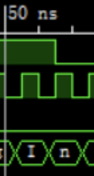
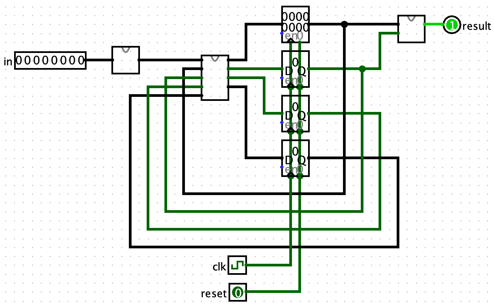

# P1课下-做题记录

## P1.Q1 P1_L0_splitter 题目编号 1120-30

### 源代码文件
- [splitter.v](https://gitee.com/ap0stader/CO_2023_Fall/blob/main/2_P1/ISE/P1_Q1/splitter.v)

一道基础复习题。复习创建工程，新建模块，定义一位和多位的输出以及`assign`的使用。


## P1.Q2 P1_L0_ALU 题目编号 1120-27

### 源代码文件
- [alu.v](https://gitee.com/ap0stader/CO_2023_Fall/blob/main/2_P1/ISE/P1_Q2/alu.v)
- [alu_test.v](https://gitee.com/ap0stader/CO_2023_Fall/blob/main/2_P1/ISE/P1_Q2/alu_test.v) : TestBench

### 思考
一道基础练习题。核心是实现一个MUX。既可以用三元运算符嵌套完成，也可以用`always`配合`case`来完成。个人认为使用后一种代码更为清晰。  
使用三元运算符嵌套完成：要注意将进行有符号数处理的符号右移单独提取出来，或对其整体加上`$signed()`以避免无符号性向内传播（参见<http://cscore.buaa.edu.cn/#/discussion_area/987/1182/posts>）。  
使用`always`配合`case`来完成：组合逻辑的`always`中要注意使用**阻塞赋值**，并且被赋值的要是**reg类型**。`case`要注意`default`分支，避免意外生成寄存器。若确实要有保存上一次状态的功能，应显式地声明一个寄存器。

### 问题
1. **ISE中数字没有声明位宽的，默认为32位，没有声明数字进制的，默认为十进制。**第一次提交时，`case`中表示各情况的数字没有写位宽和进制（参见<http://cscore.buaa.edu.cn/tutorial/verilog/verilog-3/verilog-3-2/#_2>），导致WA了一次。


## P1.Q3 P1_L0_EXT 题目编号 1120-271

### 源代码文件
- [ext.v](https://gitee.com/ap0stader/CO_2023_Fall/blob/main/2_P1/ISE/P1_Q3/ext.v)

一道基础练习题。和Q2一样核心是实现一个MUX。位拓展可以使用拼接运算符完成。  
要注意拼接运算符的语法，一个比较容易出现的错误是`{16{1'b0}, imm}`，应该为`{{16{1'b0}}, imm}`或`{16'b0, imm}`。（参见<http://cscore.buaa.edu.cn/#/discussion_area/993/1219/posts>）。


## P1.Q4 P1_L0_gray 题目编号 1120-28

### 源代码文件
- [gray.v](https://gitee.com/ap0stader/CO_2023_Fall/blob/main/2_P1/ISE/P1_Q4/gray.v)
- [gray_test.v](https://gitee.com/ap0stader/CO_2023_Fall/blob/main/2_P1/ISE/P1_Q4/gray_test.v) : TestBench

### 思考
一道基础练习题。写一个无输入的状态机，按照格雷码的要求进行状态转移和输出即可。  
也可以分成两个部分，第一部分为时序逻辑，实现一个普通二进制计数器并且实现溢出位输出。第二部分为组合逻辑，实现输入一个二进制数，输出对应的格雷码。  

### 参考电路设计
<center></center>

### 问题
1. 第一次提交时，没有考虑使能信号En，导致WA了一次。这个问题在进行仿真时ISE并没有明显的警告。但是在进行综合时ISE会有警告`Input <En> is never used.`。


## P1.Q5 P1_L0_表达式状态机 题目编号 1120-24

### 源代码文件
- [expr.v](https://gitee.com/ap0stader/CO_2023_Fall/blob/main/2_P1/ISE/P1_Q5/expr.v)

### 思考
根据题目描述，本题要求实现**Moore型状态机**。按照序列输入判断型状态机的设计方法设计状态和转移，合并重复状态后，按照状态机模板进行编写即可。  
本人比较习惯的写法是“两段式状态机”，但是与教程不同。一段是次态逻辑和状态转移，一段是输出逻辑。  

### 异步复位
1. 在[Verilog 代码规范](http://cscore.buaa.edu.cn/tutorial/verilog/verilog-5/verilog-coding-standard/)中指出，一个信号应只在一个`always`中赋值。如果一个信号在多个`always`中赋值，其结果是不可预测的。故以下的写法是不合理的。
    ```Verilog
    always @(posedge clk) begin
        // 次态逻辑
    end

    always @(posedge clr) begin
        // 实现清零
    end
    ```
2. 应该让一个`always`对`clk`和`clr`两个信号的上升沿同时敏感。在`always`中判断`clr`的是否为高电平决定是否进行复位。**注意题目对于异步复位信号是高电平有效还是低电平有效决定使用posedge还是negedge**。
    ```Verilog
    always @(posedge clk, posedge clr) begin
        if (reset) begin
            // 实现清零
        end
        else begin
            // 次态逻辑
        end
    ```
3. 这样的设计方法虽然同时也对`clk`的上升沿敏感，但是并不会导致所谓的`clr`信号多个周期都为高，但是复位只能在一个周期内有效的问题（本人曾在这个问题上错误地给其他同学进行解答，参见<http://cscore.buaa.edu.cn/#/discussion_area/980/1355/posts>）。因为即使`clk`上升沿来临，若此时`clr`仍为高电平，依然会执行的是复位而非状态转移。

### 状态设计原稿
<center></center>

### 问题
1. 第一次提交时，考虑到可能用`always`给输出out赋值，故提前将其修改为reg类型。但最后使用了`assign`，但是并没有将其改回wire类型，导致平台报错`We got no valid output.`，WA了一次。另外，犯这个错误时ISE会在仿真时警告`Target <out> of concurrent assignment or output port connection should be a net type.`。


## P1.附加题 P1_L1_BlockChecker 题目编号 1120-406

### 源代码文件
- [BlockChecker_ok.v](https://gitee.com/ap0stader/CO_2023_Fall/blob/main/2_P1/ISE/P1_BlockChecker/BlockChecker_ok.v) : AC，未优化版本
- [BlockChecker.v](https://gitee.com/ap0stader/CO_2023_Fall/blob/main/2_P1/ISE/P1_BlockChecker/BlockChecker.v) : AC，已优化版本
- [BlockChecker_test.v](https://gitee.com/ap0stader/CO_2023_Fall/blob/main/2_P1/ISE/P1_BlockChecker/BlockChecker_test.v) : TestBench

### 思考
1. 什么情况result要输出1，什么情况result要输出0是首要问题。当一开始没有输入时，result应当为1。当end的数量与begin的数量不相等时，result应当为0。但是当end的数量与begin的数量相等时，result不一定为1，如`end begin`，显然应当输出0。故应当细化为**当end的数量与begin的数量相等时，若在此之前未出现过end的数量大于begin的数量，result应当输出1。若出现了end的数量大于begin的数量，则无论后续的输入，result都应当保持0（“死锁”状态）**。
2. 接下来考虑这个状态机是Moore型状态机还是Mealy型状态机。题目中写到`建议大家认真查看示例波形。`。在示例波形50ns后的`n`处可以确定该状态机为**Moore型状态机**，因为result是随着时钟的变化而变化。同时，result的变化相比输入从I变为n有所滞后，不是随着输入的变化而变化，即不是Mealy型状态机。  

3. 这道题的状态机的状态要表示三个方面的事情，第一方面：begin的数量和end的数量的情况，第二方面：是否出现过end的数量大于begin的数量，第三方面：与输入序列识别相关的状态。考虑用三个寄存器来表示这件事情，输出result由前两个寄存器决定。
    - 第一个寄存器负责管理begin和end的数量，考虑到与result相关的只是begin和end的相对关系，故只需要保存**未被匹配的begin的数量**。
    - 第二个寄存器表示**是否出现end的数量大于begin的数量**。这个寄存器一方面可以标记进入了“死锁”状态，直接决定输出result为0。另一方面可以表示第一个寄存器已经被减到了负数。但实际上判断要被减到负数就不去减，避免在Verilog中很容易出现错误的有符号数处理。
    - 第三个寄存器表示处理输入序列识别的各个状态，于一般的输入序列识别转态机相同。
4. ***并非最佳实践，仅记录思路历程***。但是以上仍然是不够的。题目中的输出已经提示如`begin end endx`这样的序列，在`endx`的`end`输入时，end的数量已经大于begin的数量，应当进入“死锁”状态。若后面是一个空格，则确实要进入“死锁”状态。若后面是一个字母，则要从“死锁”状态中恢复。为了防止，`end begin endx`这样的序列将状态机不正确地从“死锁”状态中转移出来（`endx`的`x`让状态机从“死锁”状态中恢复），需要一个寄存器表示是否是因为刚才输入的end导致进入“死锁”状态来辅助判断是否应该从“死锁”状态中恢复。
5. 另外此题的输入可以为大写字母或者小写字母，在每个状态都判断两种字母不方便，可以在判断前先进行处理，将所有的大写字母转换为小写字母后统一进行判断。  

### 参考电路设计
<center></center>

### 状态设计原稿
<center></center>
这个设计是基于思考中第4点得到的，除此之外还有另外一种更好的实现方法。在S8中输入字母时，转移到S9，解除“死锁”状态或将未匹配的begin的数量加1。新增一种状态S10，该状态无条件转移到本状态S10（即“死锁”状态，只有reset信号才能让状态机从这个状态中转移出来）。在S8中输入空格时，若第二个寄存器为1，则转移到S10，否则转移到S0。这样可以减少一个不必要的寄存器（增加一个一位的寄存器可以转变为增加一个状态）。

### 问题
1. **习惯给case的每个情况的后面立即写上begin-end**，就像C语言if、for就算只有单条语句也写上大括号。后者可以避免因为要变成多条语句时可能没有把后面加上的语句循环上的问题。前者可以省去将近一个小时面对着`syntax error near if`、`syntax error near ;`这样难以理解分析的错误debug。
    - 具体来说，类似C语言，`case`的一个情况只能执行一条语句或者一个语句块。
    - 这样写是合法的，整个if-elseif-else会被认为是一个语句块
        ```Verilog
            case (status) :
                `S0:
                if () begin
                    // do something
                end
                else if() begin
                    // do something
                end
                else begin
                    // do something
                end
        ```
    - 这样写是不合法的，因为`case`的每种情况只能执行一条语句或一个语句块，编译器无法理解除了第一条语句之外的所有语句的归属，但是ISE只会报在第一条语句的分号附近或者if附近有`syntax error`，难以理解。
        ```Verilog
            case (status) :
                `S0:
                // do something
                if () begin
                    // do something
                end
                else begin
                    // do something
                end
                if() begin
                    // do something
                end
                else begin
                    // do something
                end
        ```
    - 搭建`case`的框架的时候应习惯立即写上begin-end
        ```Verilog
            case (status) :
                `S0: begin
                    // do something
                end
                `S1: begin
                    // do something
                end
                default: begin
                    // do something
                end
        ```
